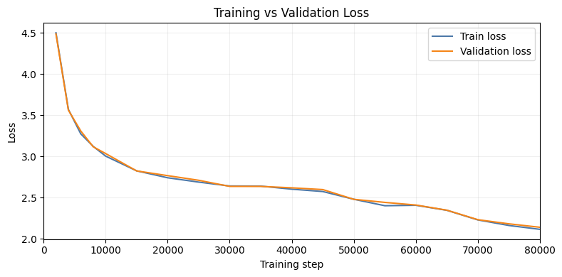

# Project Lumen

A 128M Parameter Language Model Built from Scratch

Project Lumen is a foundational language model created entirely from scratch for learning and research purposes.
It explores every step of modern LLM development — from data preprocessing and tokenization to architecture design, training, evaluation and so on...

## 🎯 Overview

This project implements a GPT-style transformer model from scratch using PyTorch, featuring grouped multi-query attention (GQA), SwiGLU activation, and RMSNorm. The **128M parameter** model is trained on custom datasets and evaluated on standard NLP benchmarks.

## 📁 Project Structure

```
PreTraining/
├── Implementation/       # Model training and data preparation
├── Benchmark/           # Model evaluation on benchmarks
├── Inference/          # Text generation and inference
```

## ✨ Key Features

- **Custom Transformer Architecture**
  - Grouped Multi-Query Attention (GQA) for efficient inference
  - SwiGLU feed-forward networks
  - RMSNorm for layer normalization
  - Rotary Position Embeddings (RoPE)
  - Weight tying between embedding and output layers

- **Training Pipeline**
  - Mixed precision training (FP16/BF16)
  - Gradient accumulation and clipping
  - Cosine annealing with linear warmup
  - Automatic checkpointing and resume support

- **Benchmarking**
  - ARC (AI2 Reasoning Challenge) - Easy & Challenge
  - HellaSwag commonsense reasoning

## 🚀 Quick Start

**Training Pipeline:**
1. **Data Preparation** → `01_Dataset-Prepration.ipynb`
2. **Train Tokenizer** → `02_Training-Tokenizer.ipynb` (BPE, 32K vocab)
3. **Tokenize Dataset** → `03_Tokenizing-Dataset.ipynb`
4. **Pre-train Model** → `PreTraining.ipynb`
5. **Run Inference** → `Inference/Inference.ipynb`

**Using the Model:**

```python
import torch
from ModelArchitecture import Transformer, ModelConfig, generate
from tokenizers import Tokenizer

# Load model
config = ModelConfig(vocab_size=32000, hidden_size=768, n_heads=12, 
                     n_kv_heads=4, n_layers=12, max_position_embeddings=2048)
model = Transformer(config)
model.load_state_dict(torch.load('Models/LumenBase.safetensors'))
model.eval()

# Generate text
tokenizer = Tokenizer.from_file('LumenTokenizer.json')
prompt = "Once upon a time"
input_ids = torch.tensor([tokenizer.encode(prompt).ids])

output = generate(model, input_ids, max_new_tokens=100, 
                 temperature=0.8, top_k=50, top_p=0.9)
print(tokenizer.decode(output[0].tolist()))
```

## 📊 Model Configuration

```python
vocab_size: 32000          # BPE tokenizer vocabulary
hidden_size: 768           # Model dimension
n_heads: 12                # Query heads
n_kv_heads: 4              # Key-Value heads (GQA)
n_layers: 12               # Transformer layers
intermediate_size: 3072    # FFN dimension
max_position_embeddings: 2048
```

## 🎛️ Training Setup

- **Optimizer**: AdamW (lr=3e-4, weight_decay=0.1)
- **Batch**: 12 × 4 accumulation = 48 effective
- **Precision**: Mixed (BF16/FP16/FP32)
- **Scheduler**: Linear warmup + Cosine annealing



## 📈 Evaluation

**Benchmarks:** ARC-Easy, ARC-Challenge, HellaSwag

| Benchmark | Accuracy | Correct/Total |
|-----------|----------|---------------|
| ARC-Easy | 39.48% | 938/2,376 |
| ARC-Challenge | 23.55% | 276/1,172 |
| HellaSwag | 32.62% | 334/1,024 |

Run evaluation: `PreTraining/Benchmark/Benchmark.ipynb`

## 🔧 Requirements

```bash
pip install torch numpy tqdm tokenizers datasets huggingface_hub matplotlib
```

## 🎨 Sampling Strategies

- **Greedy**: temperature=0
- **Top-k**: Sample from k most likely tokens
- **Top-p (Nucleus)**: Sample from cumulative probability p
- **Temperature**: Control randomness (lower = deterministic)

## 📄 License

Apache License 2.0 - See LICENSE file for details.

---

**Note**: Educational/research implementation. For production, use established frameworks like Hugging Face Transformers.
