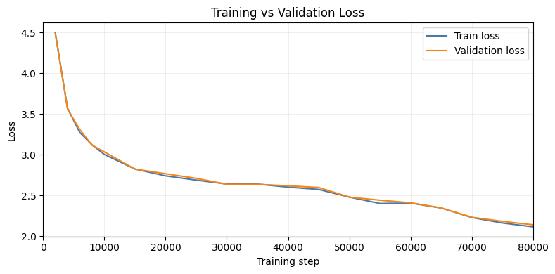

# Model Card for LumenBase

A 128M parameter GPT-style transformer built from scratch for educational purposes, featuring Grouped Multi-Query Attention (GQA), SwiGLU, RMSNorm, and RoPE.

## Model Details

### Model Description

LumenBase is a decoder-only transformer language model implementing modern architectural optimizations:
- **Architecture**: 12-layer transformer with GQA (12 query heads, 4 KV heads), SwiGLU activation, RMSNorm, and RoPE
- **Parameters**: 128M (768 hidden size, 3072 FFN, 2048 context length)
- **Training**: Mixed precision (FP16/BF16) with custom tokenizer (32K vocab)

- **Developed by:** Hariom Jangra
- **Model type:** Decoder-only Transformer
- **Language:** English
- **License:** MIT
- **Repository:** https://github.com/HariomJangra/project-lumen

## Uses

**Direct Use:**
- Text generation and completion
- Educational resource for understanding transformer architecture
- Research baseline for language models
- Foundation for fine-tuning on specific tasks

**Downstream Use:**
- Instruction tuning
- Chat applications
- Domain-specific fine-tuning

**Out-of-Scope:**
- Production deployments
- Safety-critical applications
- Applications requiring factual accuracy without verification
- This is an educational model - use established frameworks for production

## Limitations

**Technical:**
- Limited size (128M parameters) - below state-of-the-art performance
- 2048 token context window
- May generate incoherent text for complex prompts

**Bias & Safety:**
- May perpetuate training data biases
- Not evaluated for fairness across demographics
- Can generate inappropriate content
- Should not be relied upon for factual information

**Recommendations:** This is an educational model. Verify all outputs, implement content filtering for applications, and use production-ready models for commercial use.

## Training

**Data:** Custom datasets tokenized with BPE (32K vocab)

**Hyperparameters:**
- Optimizer: AdamW (lr=3e-4, weight_decay=0.1)
- Batch: 12 × 4 gradient accumulation = 48 effective
- Sequence length: 2048 tokens
- Scheduler: Linear warmup + Cosine annealing
- Precision: Mixed (FP16/BF16/FP32)
- Dropout: 0.1 (training), 0.0 (inference)



## Evaluation

Evaluated on standard NLP benchmarks:

| Benchmark | Accuracy | Correct/Total |
|-----------|----------|---------------|
| **ARC-Easy** | 39.48% | 938/2,376 |
| **ARC-Challenge** | 23.55% | 276/1,172 |
| **HellaSwag** | 32.62% | 334/1,024 |

**Summary:** Baseline performance consistent with a 128M educational model. Results show capability on easier tasks with room for improvement on complex reasoning.

## Technical Specifications

**Architecture:** Decoder-only Transformer
- 12 layers, 768 hidden size, 12 attention heads (4 KV heads)
- SwiGLU FFN (3072 intermediate), RMSNorm, RoPE
- 32K vocab, 2048 max sequence length
- Weight tying between embedding and output layers

**Implementation:** Custom PyTorch implementation from scratch

**Software:** Python 3.13, PyTorch, NumPy, Tokenizers, tqdm, matplotlib

## How to Use

```python
import torch
from ModelArchitecture import Transformer, ModelConfig, generate
from tokenizers import Tokenizer

# Load configuration and model
config = ModelConfig(vocab_size=32000, hidden_size=768, n_heads=12, 
                     n_kv_heads=4, n_kv_groups=3, head_dim=64, n_layers=12,
                     intermediate_size=3072, max_position_embeddings=2048,
                     dropout=0.0, pre_norm=True, tie_weights=True)

model = Transformer(config)
model.load_state_dict(torch.load('LumenBase.safetensors'))
model.eval()

# Generate text
tokenizer = Tokenizer.from_file('LumenTokenizer.json')
prompt = "Once upon a time"
input_ids = torch.tensor([tokenizer.encode(prompt).ids])

output = generate(model, input_ids, max_new_tokens=100, 
                 temperature=0.8, top_k=50, top_p=0.9)
print(tokenizer.decode(output[0].tolist()))
```

## Citation

```bibtex
@misc{lumenbase2024,
  author = {Jangra, Hariom},
  title = {LumenBase: A 128M Parameter Language Model Built from Scratch},
  year = {2024},
  publisher = {GitHub},
  howpublished = {\url{https://github.com/HariomJangra/project-lumen}}
}
```

## Contact

**Author:** Hariom Jangra ([@HariomJangra](https://github.com/HariomJangra))

For questions or feedback, please open an issue on the [GitHub repository](https://github.com/HariomJangra/project-lumen).